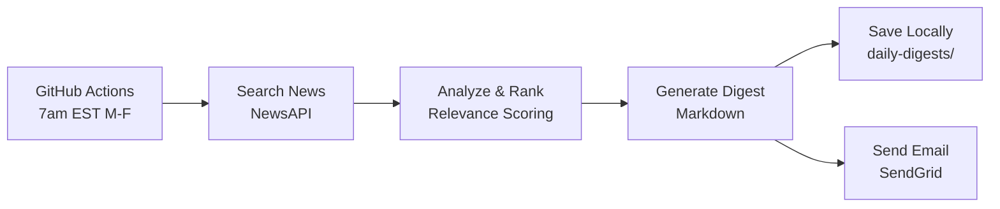

# OpenAI Frontier Security & Daily Digest

Comprehensive security readiness documentation and automated news digest for the OpenAI Frontier enterprise partnership.

---

## 📋 Overview

This repository contains:

1. **Security Readiness Documentation** - Comprehensive security questionnaire and assessment framework for OpenAI Frontier partnership onboarding
2. **Daily Digest Automation** - Automated system that delivers top OpenAI Frontier news to your inbox every weekday at 7am
3. **Thought Leaders Tracking** - Curated list of top AI security experts and resources to follow

---

## 🚀 Quick Start

### For Security Readiness:
- Review [`OpenAI-Frontier-Security-Readiness.md`](./OpenAI-Frontier-Security-Readiness.md) - Complete security questionnaire
- Check [`AI-Security-Thought-Leaders.md`](./AI-Security-Thought-Leaders.md) - Top experts to follow
- Read [`Session-Notes.md`](./Session-Notes.md) - Context and research findings

### For Daily Digest:
- Follow the step-by-step guide in [`SETUP.md`](./SETUP.md)
- Estimated setup time: 20-30 minutes
- Cost: $0 (free tier tools)

---

## 📰 Daily Digest Features

### What You Get

Every weekday at 7am EST, receive an email digest containing:

- **3-7 Top Stories** about OpenAI Frontier
- **Quick Read Format:** Title, source, link, summary
- **Why You Should Care:** Relevance to your organization
- **What This Means:** Strategic implications
- **Archived Locally:** Saved to `daily-digests/` folder

### How It Works



### Technology Stack

- **Scheduling:** GitHub Actions (free tier)
- **Email Delivery:** SendGrid (100 emails/day free)
- **News Gathering:** NewsAPI (100 requests/day free)
- **Language:** Python 3.11+
- **Total Cost:** $0/month

---

## 📁 Repository Structure

```
OpenAI Frontier/
├── .github/
│   └── workflows/
│       └── daily-digest.yml          # GitHub Actions workflow (7am M-F)
│
├── scripts/
│   ├── generate_digest.py            # Main digest generation script
│   ├── config.py                     # Configuration settings
│   └── requirements.txt              # Python dependencies
│
├── daily-digests/                    # Local digest archive (gitignored)
│   ├── 2026-02-17.md
│   ├── 2026-02-18.md
│   └── ...
│
├── OpenAI-Frontier-Security-Readiness.md   # Security questionnaire (10 domains)
├── AI-Security-Thought-Leaders.md          # Top 10 experts to follow
├── Session-Notes.md                        # Research findings & context
│
├── SETUP.md                          # Detailed setup instructions
├── README.md                         # This file
└── .gitignore                        # Excludes secrets & local digests
```

---

## 🔒 Security Readiness Documents

### OpenAI-Frontier-Security-Readiness.md

Comprehensive questionnaire covering 10 security domains:

1. **Identity & Access Management** - Entra ID, RBAC, MFA
2. **Data Classification & Protection** - Encryption, DLP, PII handling
3. **Compliance & Certifications** - GDPR, HIPAA, SOC 2, ISO 27001
4. **Workload & Device Management** - Intune, MDM, conditional access
5. **AI Agent Security & Governance** - Agent identity, guardrails, policies
6. **Network & Infrastructure Security** - API security, cloud architecture
7. **Security Monitoring & Incident Response** - SIEM, threat detection
8. **Vendor & Third-Party Risk Management** - Integration security
9. **Training & Awareness** - Security training, AI usage guidelines
10. **Backup & Disaster Recovery** - RTO/RPO, business continuity

### AI-Security-Thought-Leaders.md

Top 10 experts to follow:

- Tal Eliyahu (AISecHub)
- Apostol Vassilev (NIST)
- Johann Rehberger (AI Agent Security)
- Michael Bargury (Zenity)
- Microsoft AI Red Team leaders
- OWASP Gen AI Security Project contributors
- And more...

Plus: Organizations, newsletters, podcasts, conferences, and resources.

---

## 🛠️ Setup Instructions

### Prerequisites

- GitHub account (free)
- SendGrid account (free tier)
- NewsAPI account (free tier, optional)
- Git installed locally
- Python 3.11+ (for local testing only)

### Step-by-Step Setup

See **[SETUP.md](./SETUP.md)** for complete instructions.

Quick summary:

1. **SendGrid:** Create account, get API key, verify sender
2. **NewsAPI:** Sign up, copy API key
3. **GitHub:** Create repository, push code
4. **Secrets:** Add API keys to GitHub Secrets
5. **Test:** Manual workflow trigger
6. **Verify:** Wait for 7am scheduled run

---

## 🎯 What is OpenAI Frontier?

**Launch Date:** February 5, 2026

**Description:** OpenAI Frontier is an end-to-end enterprise platform for building, deploying, and managing AI agents that automate core workflows at scale.

**Key Capabilities:**
- Acts as intelligence layer integrating disparate systems
- Supports OpenAI, Google, Microsoft, and Anthropic agents
- Provides identity management and permissions for each AI agent
- Each agent has explicit guardrails and operational boundaries

**Compliance:**
- SOC 2 Type II
- ISO/IEC 27001, 27017, 27018, 27701
- CSA STAR

**Initial Customers:**
- Uber, State Farm, Intuit, Thermo Fisher Scientific

**Frontier Partners:**
- Abridge, Clay, Ambience, Decagon, Harvey, Sierra

---

## 📊 Key Research Findings

### AI Agent Security Gaps (2026)

From CISO AI Risk Report:
- 71% of organizations use AI tools accessing core systems
- **Only 16%** effectively govern AI agent access
- 92% lack full visibility into AI identities
- 95% doubt ability to detect/contain AI agent misuse

### Expert Predictions for 2026

- "AI is no longer a feature — it's an actor" (Rosario Mastrogiacomo, SPHERE CSO)
- Autonomous AI agents will cause high-profile data breaches (Jack Cherkas, Syntax Global CISO)
- Defenders will regain advantage against AI-enabled threats (Nicole Reineke, N-able)

### Gartner Forecast

- 40% of enterprise applications will feature task-specific AI agents by 2026
- Only 6% of organizations have advanced AI security strategy

---

## 🔧 Customization

### Change Digest Time

Edit `.github/workflows/daily-digest.yml`:

```yaml
schedule:
  - cron: '0 13 * * 1-5'  # 8am EST instead of 7am
```

### Modify Story Count

Edit `scripts/config.py`:

```python
MIN_STORIES = 5
MAX_STORIES = 10
```

### Add Search Queries

Edit `scripts/config.py`:

```python
SEARCH_QUERIES = [
    'OpenAI Frontier news',
    'OpenAI Frontier enterprise',
    # Add your own queries
]
```

---

## 📈 Monitoring & Maintenance

### Daily

- ✅ Check email delivery (Mon-Fri at 7am)

### Weekly

- 📊 Verify digest quality and relevance
- 🔍 Review GitHub Actions runs for errors

### Monthly

- 📝 Update thought leaders list (15th of month)
- 🔐 Rotate SendGrid API key (security best practice)
- 📊 Review NewsAPI usage

---

## 🐛 Troubleshooting

### Email Not Received

1. Check SendGrid Activity dashboard
2. Verify GitHub Secrets are set correctly
3. Check spam folder
4. Ensure sender is verified in SendGrid

### GitHub Actions Failing

1. Go to Actions tab → View failed run
2. Check logs for error messages
3. Verify all secrets: `SENDGRID_API_KEY`, `RECIPIENT_EMAIL`, `NEWSAPI_KEY`

### No News Stories

- Normal on slow news days
- NewsAPI key may not be configured
- Check API rate limits (100 requests/day)

See **[SETUP.md](./SETUP.md#troubleshooting)** for detailed troubleshooting.

---

## 📚 Resources

### OpenAI Frontier Documentation

- [Introducing OpenAI Frontier](https://openai.com/index/introducing-openai-frontier/)
- [OpenAI Frontier Enterprise Platform](https://openai.com/business/frontier/)
- [Business data privacy, security, and compliance](https://openai.com/business-data/)
- [Security and privacy at OpenAI](https://openai.com/security-and-privacy/)

### Security Best Practices

- [OpenAI API Security](https://www.reco.ai/hub/openai-api-security)
- [OpenAI safety best practices](https://www.eesel.ai/blog/openai-safety-best-practices)
- [OWASP Top 10 for Agentic Applications 2026](https://genai.owasp.org/resource/owasp-top-10-for-agentic-applications-for-2026/)

### Microsoft Integration

- [Microsoft Entra ID authentication](https://learn.microsoft.com/en-us/azure/ai-foundry/openai/how-to/managed-identity?view=foundry-classic)
- [Role-based access control for Azure OpenAI](https://learn.microsoft.com/en-us/azure/ai-foundry/openai/how-to/role-based-access-control?view=foundry-classic)

---

## 🤝 Contributing

This is a private repository for organizational use. For questions or suggestions:

- Review existing documentation
- Check [SETUP.md](./SETUP.md) for troubleshooting
- Modify configuration files as needed

---

## 📄 License

Internal use only. Contains proprietary security planning documentation.

---

## ✅ Success Checklist

- [ ] Reviewed security readiness questionnaire
- [ ] Subscribed to top thought leaders
- [ ] Completed daily digest setup
- [ ] Received first test email
- [ ] Verified scheduled runs working
- [ ] Filled out organization-specific security answers
- [ ] Scheduled internal security review meeting

---

## 📞 Support

### Documentation

- **Setup Guide:** [SETUP.md](./SETUP.md)
- **Security Readiness:** [OpenAI-Frontier-Security-Readiness.md](./OpenAI-Frontier-Security-Readiness.md)
- **Thought Leaders:** [AI-Security-Thought-Leaders.md](./AI-Security-Thought-Leaders.md)
- **Research Notes:** [Session-Notes.md](./Session-Notes.md)

### External Resources

- SendGrid Docs: [docs.sendgrid.com](https://docs.sendgrid.com)
- NewsAPI Docs: [newsapi.org/docs](https://newsapi.org/docs)
- GitHub Actions Docs: [docs.github.com/en/actions](https://docs.github.com/en/actions)
- Cron Schedule Help: [crontab.guru](https://crontab.guru)

---

**Last Updated:** February 15, 2026
**Version:** 1.0
**Maintained by:** Todd Beavers

---

**Ready to get started?** → See [SETUP.md](./SETUP.md)
